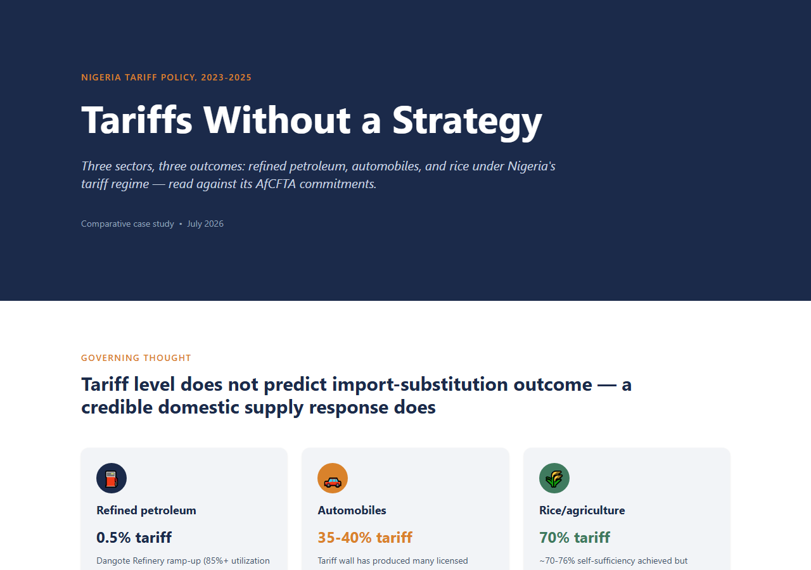

# Tariffs Without a Strategy

**A comparative case study of Nigeria's tariff policy across refined petroleum, automobiles, and rice, 2023-2025 — read against its AfCFTA commitments.**

Nigeria doesn't have one tariff policy; it has three, and they point in different directions. This project compares three sectors under materially different tariff treatment over the same policy window and asks a narrow, testable question: **does the level of tariff protection a sector receives predict whether that sector actually substitutes imports with domestic production?**

The answer is no. The least-protected sector (petroleum, ~0.5% effective tariff) shows the fastest, largest import substitution — driven by a single private refining asset, not policy. The most-protected sector (rice, 70% combined duty) shows the weakest enforcement outcome and remains Nigeria's single most-smuggled commodity. Automobiles, tariffed specifically to reward local assembly (35-40% on imports vs. 0-10% for local-assembly kits), sit at a verified **29.0% aggregate capacity utilization** across all 34 licensed assemblers. The variable that actually predicts outcomes isn't the tariff line — it's whether a credible, scaled domestic supply response exists behind it.



## Deliverables

| Format | File | Audience |
|---|---|---|
| Academic paper | [`paper/nigeria-tariff-academic-paper.md`](paper/nigeria-tariff-academic-paper.md) ([PDF](paper/nigeria-tariff-academic-paper.pdf)) | Literature review, formal methodology, APA references |
| Policy paper | [`paper/nigeria-tariff-policy-paper.md`](paper/nigeria-tariff-policy-paper.md) | Consulting-style case study |
| Investment memo | [`memo/nigeria-tariff-investment-memo.md`](memo/nigeria-tariff-investment-memo.md) | Capital-allocation read per sector |
| Slide deck | [`deck/nigeria-tariff-policy-deck.pptx`](deck/nigeria-tariff-policy-deck.pptx) | 12-slide condensed narrative |
| Interactive dashboard | [`frontend/`](frontend/) | Live charts, built with React + Recharts |

## Repository structure

```
data/raw/          sourced research notes, one folder per sector (+ AfCFTA), every figure cited
data/processed/     cleaned CSVs derived from the raw notes
models/             Python scripts that turn processed data into charts/tables (matplotlib)
outputs/            generated charts (outputs/charts/) and summary tables (outputs/tables/)
paper/              the academic and policy papers, plus the PDF build script
memo/               investment memo
deck/               PowerPoint deck + the pptxgenjs script that generates it
frontend/           React/Vite/Tailwind/Recharts dashboard, data sourced from data/processed/
```

## Methodology

Every figure traces to a named, dated source, catalogued in `data/raw/{petroleum,automobiles,rice,afcfta}/sources.md`. Where sources conflicted, both figures are reported rather than silently reconciled — see the "gaps" section at the end of each sector's `notes.md`. One correction worth flagging: the automotive capacity-utilization aggregate was originally miscalculated at ~24% during initial research; recomputing directly from the primary NADDC table gives the verified **29.0%** used throughout.

## Running this locally

**Regenerate the charts/tables** (requires the Python venv with pandas/matplotlib):
```
python models/petroleum_analysis.py
python models/automobiles_analysis.py
python models/rice_analysis.py
python models/sector_comparison.py
python models/export_frontend_data.py   # syncs data/processed/ -> frontend/src/data/
```

**Run the dashboard:**
```
cd frontend
npm install
npm run dev
```

**Rebuild the academic paper PDF:**
```
python paper/build_pdf.py
```

## License

MIT — see [LICENSE](LICENSE).
