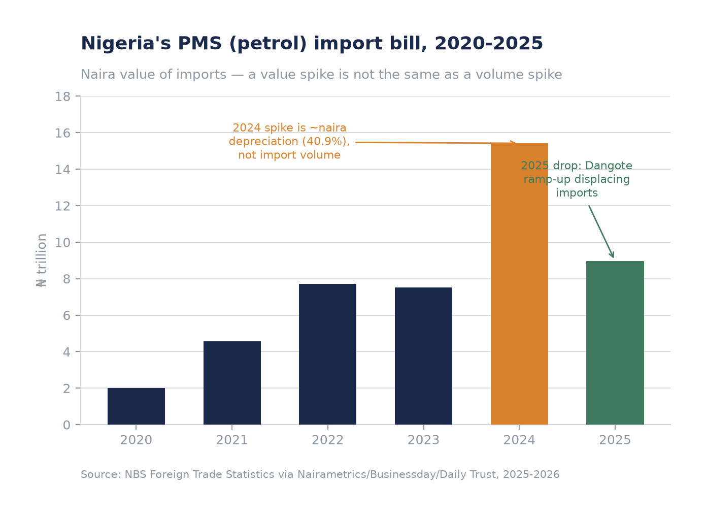
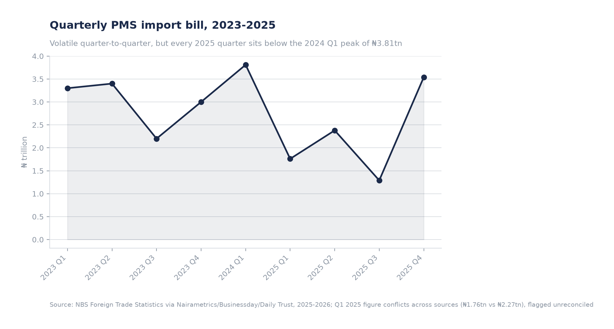
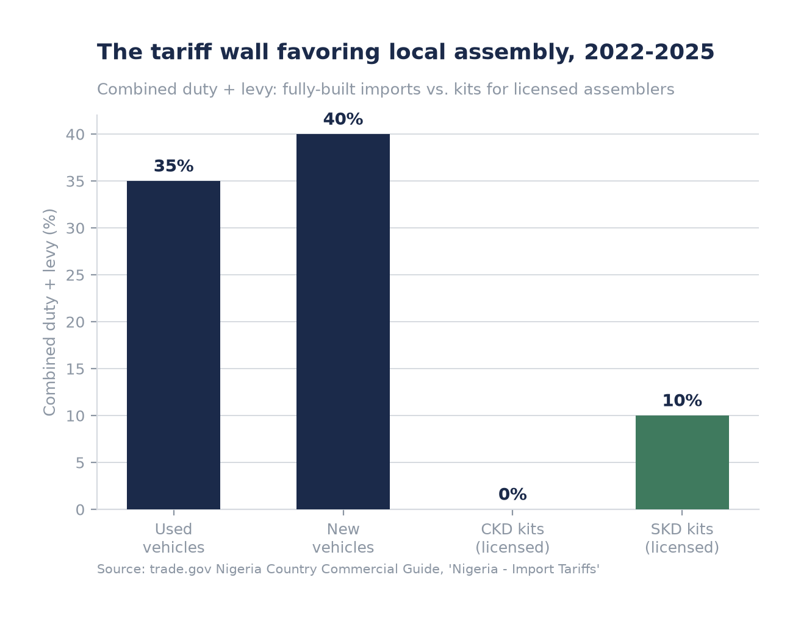
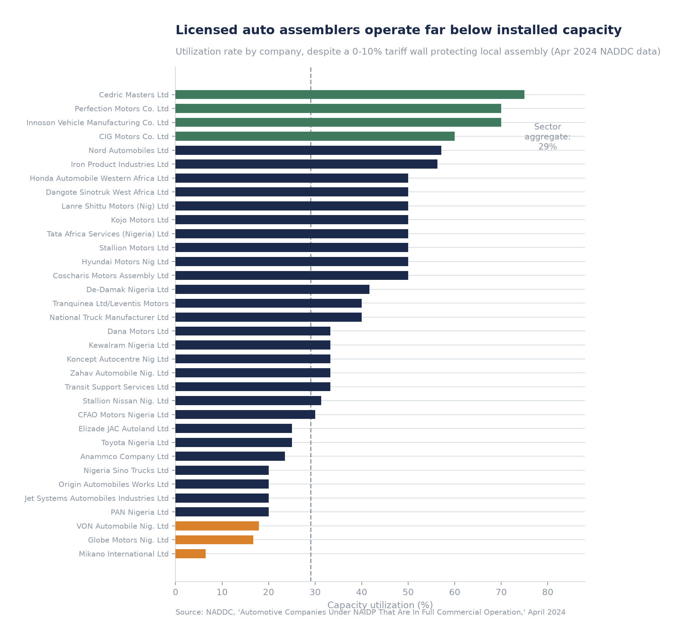
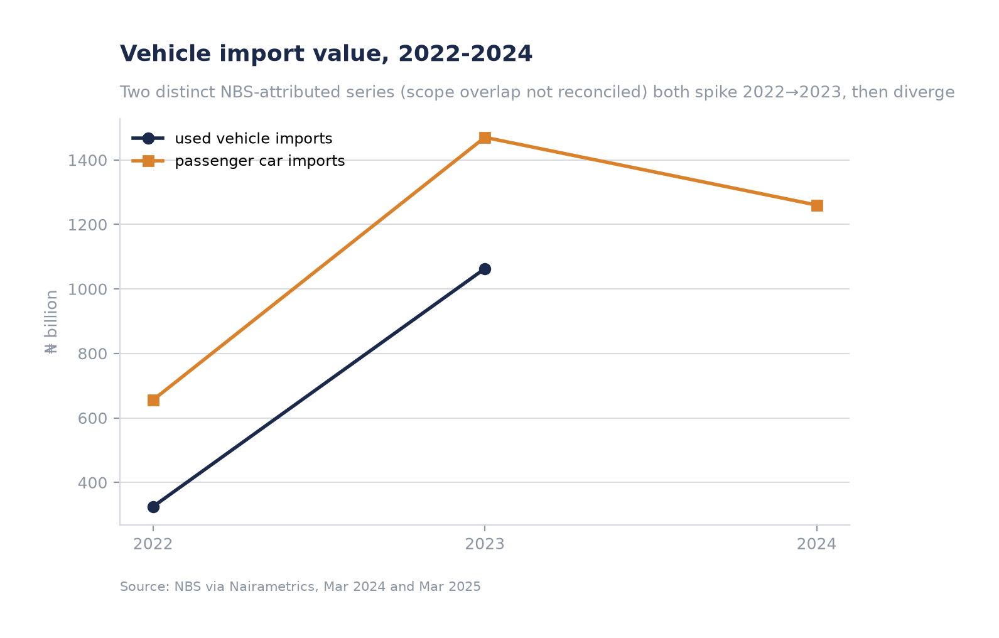
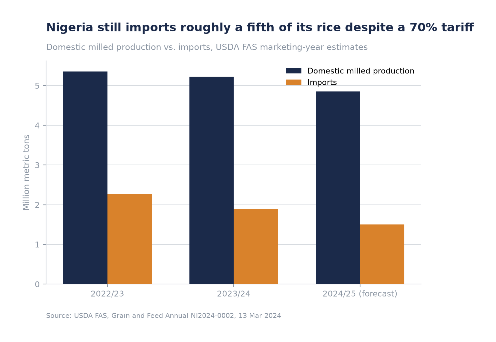
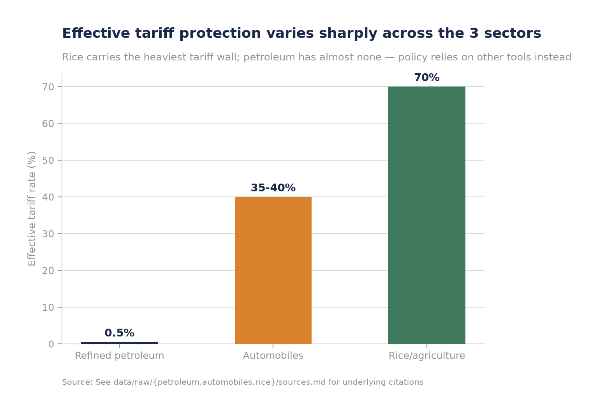

# Tariffs Without a Strategy: Three Sectors, Three Outcomes in Nigeria's Trade Policy, 2023-2025

*A comparative case study of refined petroleum, automobiles, and rice under Nigeria's tariff regime, read against its AfCFTA commitments.*

---

## Executive Summary

Nigeria does not have one tariff policy — it has three, and they point in different directions.

- **Refined petroleum** is protected almost not at all by tariff (0.5% general levy), yet is undergoing the fastest import-substitution of the three sectors, driven entirely by a private actor: the Dangote Refinery. Petrol's import bill fell 42% in 2025 as refinery utilization crossed 85%. The one dedicated petroleum tariff action of the period — a 15% duty approved in October 2025 — was suspended three weeks later, before it ever took effect.
- **Automobiles** carry a substantial 35-40% tariff wall (built around a 0-10% concession for local assembly kits), and it has produced the opposite of what it intended: 34 licensed assemblers operating at a **verified 29.0% aggregate capacity utilization**, with the enabling legislation (NAIDP) still lacking the force of law after more than a decade.
- **Rice** carries the heaviest wall of all — a 70% combined duty and levy, among the highest in Nigeria's tariff schedule — and it is the most porous. Nigeria still imports roughly a fifth of its rice at the estimated production/import ratio, and rice was the single most-smuggled commodity through Nigerian Customs checkpoints in Q1 2025.

The pattern that emerges is not "AfCFTA liberalization vs. Nigerian protectionism" — that framing, while a fair characterization of Nigeria's rice policy specifically, does not hold evenly across sectors. Nigeria has not published a sector-by-sector AfCFTA tariff classification that a researcher can independently verify, and no source found in this research states where refined petroleum or automobiles sit on that schedule at all. What the evidence does support is a sharper, more useful finding for anyone assessing Nigeria as a market: **the effective tariff rate a sector carries has little relationship to whether that sector actually substitutes imports.** Petroleum is substituting imports fastest with almost no tariff protection. Rice has the highest tariff and the most persistent import dependence. Automobiles sit in between, tariff-protected but not competitive. The variable that predicts outcomes is not the tariff line — it's whether a credible domestic supply response exists behind it.

---

## 1. Introduction

Since President Bola Tinubu's inauguration in May 2023, Nigeria's trade policy has moved in visible, sometimes contradictory bursts: a fuel subsidy removed overnight, a naira float that halved the currency's value within eighteen months, a 150-day zero-duty window for food staples, a 15% petroleum duty approved and reversed within three weeks, and — running underneath all of it — a slow-motion accession to the African Continental Free Trade Area (AfCFTA), whose tariff schedule Nigeria only formally gazetted in 2025, six years after signing the framework agreement.

This paper asks a narrow, testable question: **across three sectors that each carry meaningfully different tariff treatment, what actually explains the difference between sectors where protection "worked" and sectors where it didn't?** We use refined petroleum, automobiles, and rice/agriculture as case studies — chosen because each has been subject to a distinct tariff regime over 2023-2025, each has at least one significant primary or near-primary data source available, and together they span the range from near-zero tariff (petroleum) to the ceiling of Nigeria's tariff schedule (rice).

## 2. Data and Methodology

This paper is built from primary and secondary sources gathered and cross-checked over July 2026, covering the 2023-2025 policy window with limited forward-looking context into 2026 where directly relevant to trend continuity. Every figure cited here traces to a named, dated source, catalogued in full in `data/raw/{petroleum,automobiles,rice,afcfta}/sources.md`. Where sources conflicted, both figures are presented rather than silently reconciled. Three limitations are worth stating up front, because they shape how much weight the AfCFTA argument in particular can bear:

1. **No Nigeria-specific AfCFTA tariff classification was found for petroleum or automobiles.** Nigeria gazetted its Provisional Schedule of Tariff Concessions only in 2025 (the exact month is itself disputed between sources — April vs. September 2025), and only the continental default modality (90% of tariff lines liberalized within 5 years, 7% "sensitive" within 10, 3% excluded) is publicly confirmable. Rice's placement on an exclusion list is well evidenced; petroleum and automobiles are not.
2. **Value data dominates over volume data.** Most Nigerian trade figures available in secondary reporting (Naira import values via NBS) are not volume-adjusted, and 2024 in particular saw a 40.9% naira depreciation that inflates every naira-denominated figure independent of what actually happened to import volumes. Where this matters, it is flagged explicitly in the sector sections below.
3. **One factual correction from our own working data:** the NADDC capacity-utilization table (Section 4) is a genuine primary source, but the original research pass mis-summed it, citing ~24% aggregate utilization. Recomputing directly from the table's own rows gives **29.0%** (93,950 actual units / 323,650 installed units annually). This paper uses the verified 29.0% figure throughout.

## 3. Case Study I — Refined Petroleum: Tariffs as Signal, Not Instrument

Nigeria spent most of 2023-2025 without a dedicated import tariff on petrol (PMS) or diesel (AGO). The only broadly applicable charge was the Finance Act 2023's 0.5% levy on all non-African imports — a general revenue instrument, not a petroleum-specific policy lever.

That changed, briefly, on **21 October 2025**, when President Tinubu approved a 15% ad-valorem duty on imported PMS and AGO under the banner of a "Market-Responsive Tariffs Framework," explicitly framed by officials as protecting the newly operational Dangote Refinery and pushing Nigeria toward fuel self-sufficiency. It was projected to add roughly ₦99.72 per litre at the pump. **On 13 November 2025 — before its 30-day transition window even expired — the duty was suspended** following pushback from oil marketers and civil-society groups over the inflationary impact. The tariff was never actually collected. Read plainly, this episode is a policy signal aimed at favoring a specific local producer, not a fiscal instrument the government was prepared to defend against short-term political cost.

**The real story of import substitution in this sector has almost nothing to do with tariffs.** The Dangote Refinery — 650,000 bpd nameplate capacity — began PMS production in September 2024 and reached an estimated 85% utilization by mid-2025. As it ramped, Nigeria's petrol import bill fell from a 2024 peak of ₦15.42 trillion to ₦8.96 trillion in 2025, a 42% decline. Petrol's share of Nigeria's total imports fell from 13.64% in Q1 2025 toward near-zero by early 2026, when NMDPRA reported halting new PMS import licenses altogether on the grounds that "local production is meeting supply."

A critical caveat belongs here: the 2024 spike to ₦15.42 trillion (+105.3% year-on-year) is substantially a currency story, not a volume story. The naira depreciated 40.9% against the dollar in 2024, which alone would inflate the naira cost of a constant import volume by roughly that amount. Separating price from volume cleanly is not possible with the data available (no continuous litres/barrels time series exists across NBS, NNPC, PPPRA, or NMDPRA reporting for this period) — but the 2025 decline, which coincides directly with Dangote's ramp-up and holds up across multiple independent quarterly reports, is much harder to explain away as a currency effect alone.

The underlying mechanism replacing tariff protection is the NNPC-Dangote "naira-for-crude" arrangement: 82 million barrels of crude allocated to Dangote between October 2024 and October 2025, 60% of it naira-denominated, later renewed as a two-year supply agreement in August 2025. This deal has since shown real strain — reported shortfalls of ~79.5 million barrels between October 2025 and mid-2026, and a lawsuit from Dangote disputing whether import licenses were genuinely halted — which is itself instructive: **the substitution of imports in this sector is running ahead of the institutional arrangements needed to sustain it.**

## 4. Case Study II — Automobiles: Protection Without Competitiveness

Nigeria's automotive tariff structure is a textbook infant-industry design: fully-built vehicle imports carry a substantial duty (20% base + 15-20% National Automotive Council levy, for a combined 35% on used vehicles and 40% on new), while CKD (completely knocked-down) kits for licensed local assemblers enter at 0% and SKD (semi-knocked-down) kits at 10%. This differential — the core incentive mechanism of the National Automotive Industry Development Plan (NAIDP), first introduced in 2013 at an even steeper 70% combined rate — is explicitly designed to make local assembly the cheaper path to market.

It has not produced a competitive local industry. The clearest evidence is a primary NADDC document dated April 2024, listing 34 licensed assemblers with their installed and actual annual capacity. Summing that table directly gives:

| Metric | Value |
|---|---|
| Installed capacity (units/year) | 323,650 |
| Actual output (units/year) | 93,950 |
| **Aggregate utilization** | **29.0%** |
| Companies at 60%+ utilization | 4 of 34 |
| Companies below 20% utilization | 3 of 34 |

The distribution is instructive. **Innoson** — the only wholly Nigerian-owned mass-market OEM in the list — runs at 70% utilization. **Cedric Masters** runs at 75%. At the other end, **Mikano International** (46,000-unit installed capacity, mostly Dongfeng/Geely) runs at just 6.5%, and **PAN Nigeria** — the historic Kaduna assembly plant — runs at 20%. A tariff wall that produces a wide spread like this, rather than uniformly high utilization, is consistent with a common critique of "screwdriver assembly" policy design: many licenses appear to capture the tariff concession on CKD/SKD kits without the corresponding scale of production the policy intended.

Structurally, the policy has also never had firm legal footing. The revised NAIDP was approved by the Federal Executive Council in May 2023, but the original NAIDP's ten-year statutory term lapsed in 2024, and as of October 2025 industry stakeholders — including NADDC's own Director-General — were still publicly demanding passage of a "NAIDP Bill" into law, warning that the absence of binding legislation was deterring capital investment. One direct quote from that reporting: *"Nobody wants to commit serious capital to the auto industry without adequate laws to protect their investments."* Twenty of the 58 companies historically licensed under the plan had suspended operations entirely by March 2025, representing an estimated $89.6 million in stranded investment.

Import-value data corroborates a market responding to currency and demand pressure more than to the tariff structure itself: used-vehicle import value rose 226% in 2023 (to ₦1.06 trillion) before a separate "passenger car" series fell 14.3% in 2024, a decline explicitly attributed by reporting to naira depreciation and inflation rather than to tariff changes, which were largely stable across this window.

## 5. Case Study III — Rice: The Wall That Leaks

Rice carries the heaviest protective tariff in this comparison: a combined 70% duty and levy on standard imports (reduced to 30% for integrated millers who can prove backward integration into domestic paddy sourcing), a rate that has held roughly steady — with a documented rise from 50% to 60% at some point in 2023, layered onto the pre-existing structure — since at least 2013.

This tariff wall sits on top of a much older and blunter instrument: Nigeria's 2019 land border closure, which shut all land crossings with Benin, Cameroon, Chad, and Niger explicitly to curb rice and other agricultural smuggling. The border was only ever **partially** reopened in December 2020 — rice and poultry remained formally banned even after general goods trade resumed. The evidence is unambiguous that this has not stopped the underlying flow: in Q1 2025 alone, Nigeria Customs recorded 159 rice-smuggling seizure cases totaling 135,474 bags worth ₦939 million — making rice the single most-smuggled commodity that quarter, ahead of both petroleum products and narcotics. Further large seizures were reported through July and October 2025, indicating this is a live, ongoing enforcement failure rather than a historical footnote.

Nigeria's response to food-price pressure has, at points, cut directly against its own tariff wall. Facing food inflation that hit 39.53% by July 2024, President Tinubu approved a 150-day zero-duty, VAT-exempt import window (15 July - 31 December 2024) for six staples including husked brown rice — with tight eligibility rules limited to established Nigerian companies with real milling capacity, intended to prevent the window from simply subsidizing arbitrage. Notably, even this temporary liberalization was reported as poorly enforced in its first weeks, with importers telling reporters in August 2024 that Customs had not yet begun applying the zero-duty policy on the ground.

Despite the tariff wall, Nigeria remains a structural rice importer. USDA FAS estimates show:

| Marketing year | Domestic milled production (MMT) | Imports (MMT) | Implied self-sufficiency |
|---|---|---|---|
| 2022/23 | 5.355 | 2.275 | 70.2% |
| 2023/24 | 5.229 | 1.9 | 73.3% |
| 2024/25 (forecast) | 4.851 | 1.5 | 76.4% |

The trend line looks like improving self-sufficiency, but it is worth reading skeptically: production itself is forecast to *decline* 7% in 2024/25 (attributed to insecurity in northern growing regions and reduced mechanization investment), meaning the improving ratio is being driven partly by falling import demand — plausibly a currency-driven affordability effect, similar to the dynamic seen in petroleum and automobiles — rather than by rising domestic output. A rival production dataset (CARD/riceforafrica) shows the opposite direction, with paddy production *rising* to 9.14 MMT by 2024; the two sources were not reconcilable within this research and both should be treated as estimates, not settled figures.

## 6. Cross-Sector Synthesis

Putting the three sectors side by side makes the core finding legible in a single chart:

| Sector | Effective tariff (2025) | Primary policy tool | Outcome |
|---|---|---|---|
| Refined petroleum | 0.5% | Signaling (approved-then-suspended duty, import license halts) | Fastest import substitution of the three — driven by Dangote Refinery, not tariff |
| Automobiles | 35-40% | Sustained tariff differential (fully-built vs. CKD/SKD) | Protection without competitiveness — 29.0% aggregate capacity utilization |
| Rice/agriculture | 70% | Sustained high tariff + intermittent bans/waivers | Heaviest wall, most persistent leakage — rice is the top-smuggled commodity in Nigeria |

The relationship between tariff level and outcome is, if anything, inverse to what a simple protection thesis would predict. Petroleum has the lowest tariff and the strongest substitution result. Rice has the highest tariff and the weakest enforcement result. The variable that actually seems to matter is **whether a credible, scaled domestic supply response exists independent of the tariff** — Dangote's refinery is a single, well-capitalized actor operating at genuine industrial scale; Nigeria's auto assemblers are numerous but individually under-scaled; rice milling capacity, while real (268 mills nationwide as of May 2025), is fragmented and — per November 2025 reporting — running only partially at several of the largest operations due to high paddy and energy costs.

## 7. The AfCFTA Question: Commitment Without a Clear Test

Nigeria signed the AfCFTA framework in July 2019, but only gazetted its actual tariff concession schedule in 2025 — six years later, and after considerable internal reluctance driven by manufacturer and labor concerns about the country becoming, in the words of pre-signing domestic commentary, "a dumping ground." Nigeria joined the Guided Trade Initiative (the mechanism for actual preferential trading, as distinct from the schedule itself) in the first half of 2024 and was reported actively trading under it by February 2025.

Against that backdrop, the research supports one clear finding and one important non-finding:

- **Clear finding**: rice sits on Nigeria's AfCFTA exclusion or long-timeline "sensitive" list, alongside flour, sugar, and cement — consistent with its treatment as a food-security priority since long before AfCFTA existed. Academic work (Boysen, *The World Economy*, 2024) explicitly characterizes Nigeria as committing to liberalize 90% of tariff lines continent-wide while "remain[ing] largely protectionist in agriculture, shielding staples like rice, sugar, and poultry behind high tariffs and import controls, citing food security." The WTO's November 2024 Trade Policy Review of Nigeria makes a similar point from a different angle, with member states flagging that Nigeria's agricultural import prohibitions and tariff peaks risk contributing to food insecurity and higher food prices — the opposite of AfCFTA's stated goal.
- **Important non-finding**: no source located in this research — primary or secondary — states where refined petroleum or automobiles actually sit on Nigeria's AfCFTA schedule. This is not a minor gap; it means **a clean three-sector "AfCFTA commitment vs. domestic practice" comparison, however appealing as a narrative, cannot currently be made with confidence for two of the three sectors in this study.** What can be said with confidence is narrower and, in a sense, more useful: Nigeria's *unilateral* tariff and non-tariff tools — subsidy policy, import bans, ad hoc duty waivers, forex allocation — are doing far more work in shaping sector outcomes than its AfCFTA commitments are, at least within the 2023-2025 window. AfCFTA in this period looks less like an active constraint on Nigerian policy and more like a slowly-maturing parallel track that has not yet caught up to the pace of Nigeria's domestic policy improvisation.

## 8. Implications

For a reader assessing Nigeria as a market — whether as an investor, an operator, or a policy analyst — three implications follow from this comparison:

1. **Don't read tariff schedules as a proxy for policy seriousness.** The sector with almost no tariff (petroleum) is the one undergoing the most real structural change; the sector with the highest tariff (rice) has the weakest enforcement outcome. A tariff line tells you what the government is willing to legislate, not what it is willing or able to enforce.
2. **Look for a scaled domestic supply response as the real leading indicator.** Dangote's refinery — a single large, well-capitalized, credibly-financed asset — has done more to displace petroleum imports in eighteen months than automobile tariffs have done for local assembly in over a decade. Fragmented capacity (34 small auto assemblers, 268 rice mills) does not produce the same substitution effect even under heavier protection.
3. **Treat Nigeria's AfCFTA participation as immature, not decisive, for sector-level forecasting through at least 2025-2026.** The schedule was only gazetted in 2025; implementation data is thin; and unilateral domestic tools (subsidy policy, import license decisions, forex allocation) remain the dominant lever sector operators actually have to react to.

---

## Appendix: Data Sources and Limitations

Full sourcing for every figure in this paper is catalogued in:
- `data/raw/petroleum/sources.md`
- `data/raw/automobiles/sources.md`
- `data/raw/rice/sources.md`
- `data/raw/afcfta/sources.md`

Structured datasets underlying every chart and table in this paper are in `data/processed/`, and the analysis scripts that produced them are in `models/` (`petroleum_analysis.py`, `automobiles_analysis.py`, `rice_analysis.py`, `sector_comparison.py`). Material, unresolved data conflicts — flagged rather than silently reconciled — include: a ₦1.76tn vs. ₦2.27tn discrepancy in Q1 2025 petroleum import value across sources; a disputed gazetting date for Nigeria's AfCFTA schedule (April vs. September 2025); and conflicting rice production trends between USDA FAS (declining) and CARD/riceforafrica (rising) for overlapping years. None of these conflicts change the direction of this paper's conclusions, but a reader relying on any single figure above for a decision should verify it against the cited primary source first.
